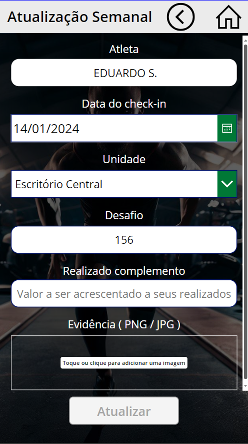
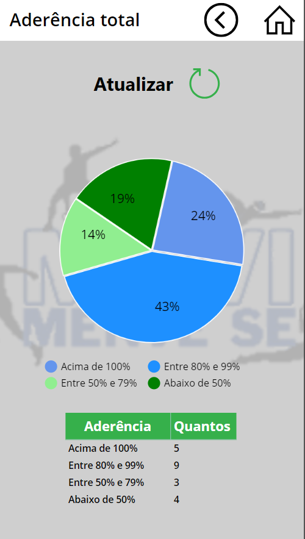
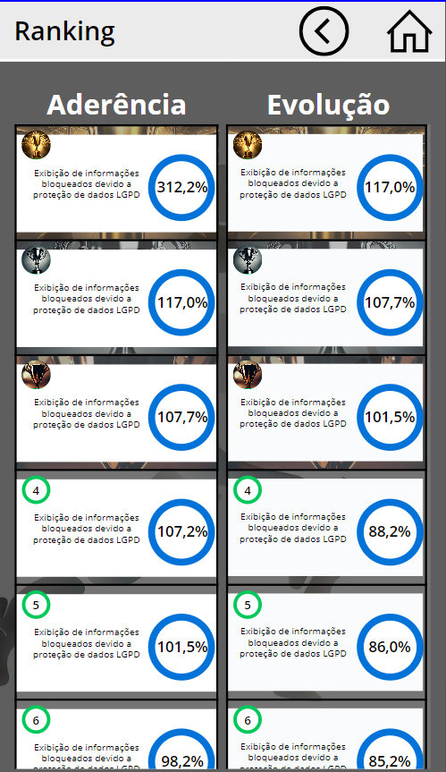

# PowerApps - Controle de Atividades Físicas

## Visão Geral

O aplicativo Controle de Atividades Físicas, desenvolvido no PowerApps, tem como objetivo auxiliar os usuários a estabelecerem e acompanharem suas metas de atividades físicas diárias. Além disso, proporciona uma experiência social ao incluir um ranking que exibe as posições dos usuários com base na aderência e evolução em relação às suas metas.

## Observações Importantes

Para uma utilização adequada do aplicativo, considere as seguintes observações:

- **Conexão com Banco de Dados:**
  - É necessário configurar uma conexão com um banco de dados para armazenar informações sobre as metas, atualizações diárias e dados do ranking. Certifique-se de ajustar as configurações antes de começar a utilizar o aplicativo.

- **Requisitos de Acesso:**
  - Faça login com as credenciais fornecidas pela equipe de TI para garantir a segurança e integridade dos dados.

- **Ranking:**
  - Participe ativamente para melhorar sua posição no ranking. A aderência e evolução constante serão refletidas nas posições.

## Funcionalidades Principais

1. **Estabelecimento de Metas:**
   - Defina suas metas diárias de atividades físicas no início de cada período.

2. **Atualizações Diárias:**
   - Atualize diariamente o progresso em relação à sua meta, informando a quantidade de atividade realizada.

3. **Ranking Interativo:**
   - Acompanhe sua posição no ranking em tempo real, comparando sua aderência e evolução com outros usuários.

## Como Usar

1. **Login:**
   - Faça login utilizando as credenciais fornecidas pela equipe de TI.

2. **Estabeleça Suas Metas:**
   - Defina suas metas diárias de atividades físicas no início de cada período.

3. **Atualizações Diárias:**
   - Diariamente, registre o progresso feito em relação à sua meta, indicando o quanto falta para atingir o objetivo.

4. **Acompanhamento no Ranking:**
   - Consulte o ranking para visualizar a posição atual e comparar com outros usuários.

## Requisitos do Sistema

- Navegador da web moderno
- Conexão com a internet para atualizações em tempo real
- Credenciais fornecidas pela equipe de TI para acesso

## Capturas de Tela

>Home\

 
>Meta\

>Atualização\

>Aderencia\

>Ranking\

